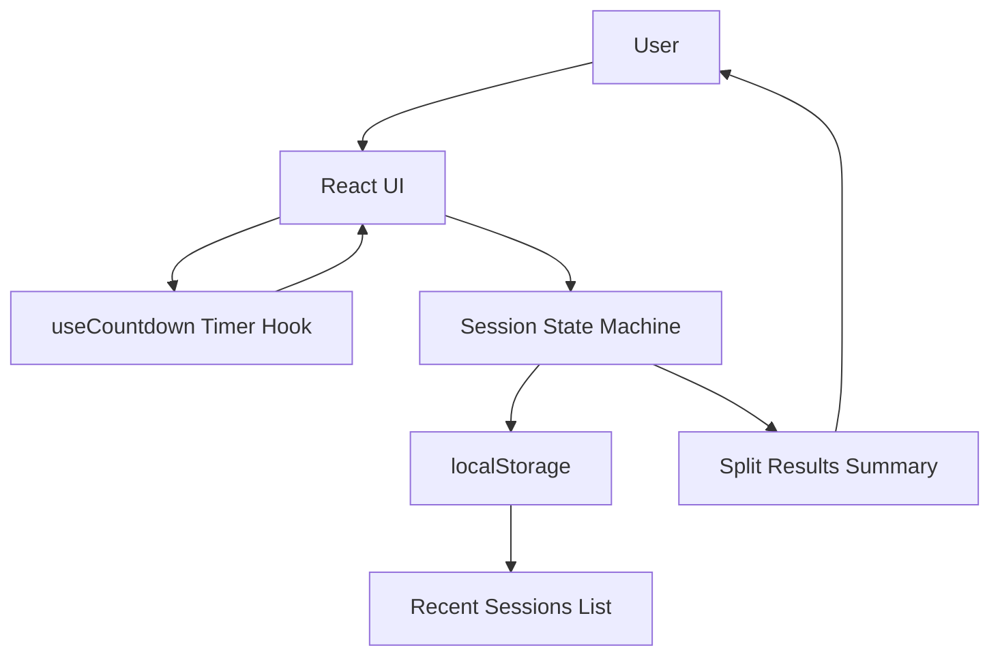

# Focus Fork

A tiny browser-based work session splitter that turns a task into two focused sprints with a single break in between. After each half, the user logs a one-tap difficulty rating, then sees a summary comparing which half felt harder and why.

## Core MVP feature

- Enter a task.
- Start a two-part focus session.
- Complete Part 1 timer, then rate difficulty with one tap.
- Take a short break screen, then start Part 2.
- Complete Part 2 timer, rate difficulty, optionally add a reflection note.
- View one summary screen with task, timestamps, both ratings, and an interpretation.
- Completed sessions are saved in browser `localStorage` and recent summaries are shown on the start screen.

## Architecture



## Run locally

Requirements: Node.js 18+ and npm.

```bash
npm install
npm run dev
```

Then open the URL printed by Vite, usually:

```bash
http://localhost:5173
```

## Build / smoke check

```bash
npm run smoke
```

This runs a TypeScript check and production build.

## Environment variables

Create a `.env` file from `.env.example` if you want to customize timing:

| Variable | Default | Description |
| --- | --- | --- |
| `VITE_SPRINT_MINUTES` | `25` | Duration of each of the two focus halves in minutes. Use `0.1` for a quick 6-second demo. |

## Data model

Stored locally as:

```ts
type Session = {
  id: string;
  task: string;
  startAt: string;
  splitAt?: string;
  endAt?: string;
  part1Rating?: DifficultyRating;
  part2Rating?: DifficultyRating;
  note?: string;
};
```
